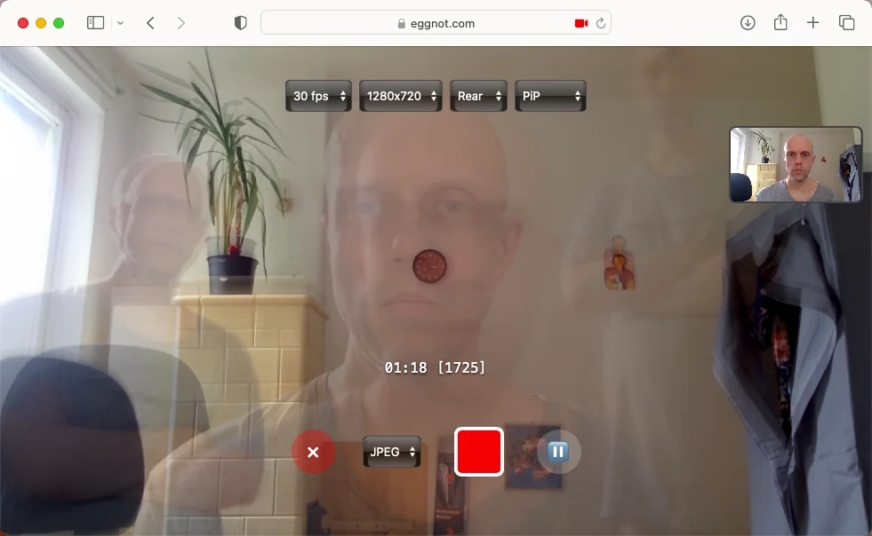
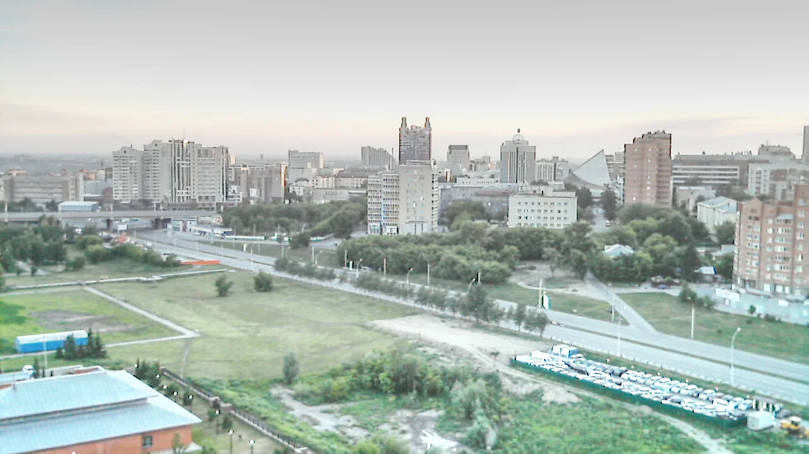
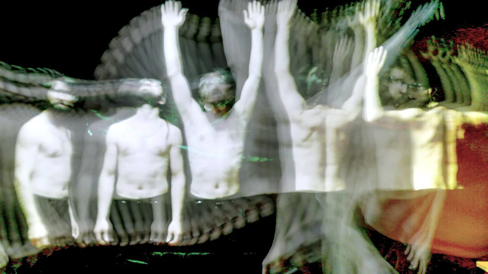
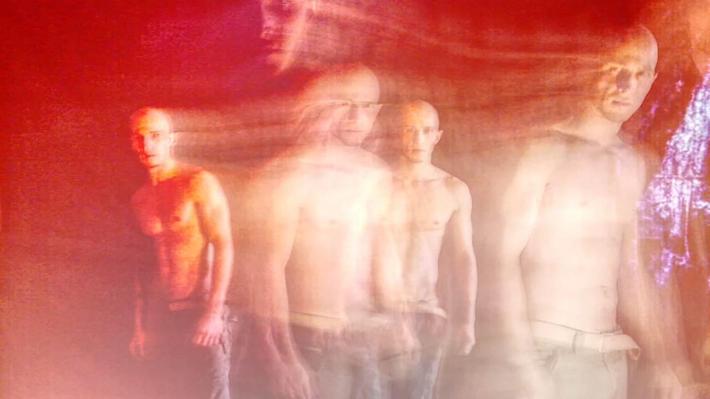
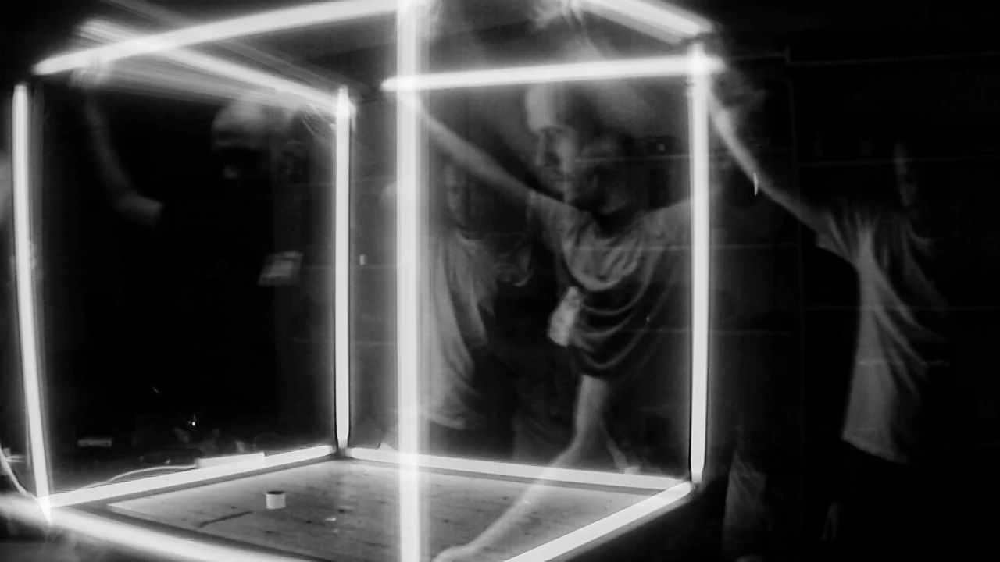
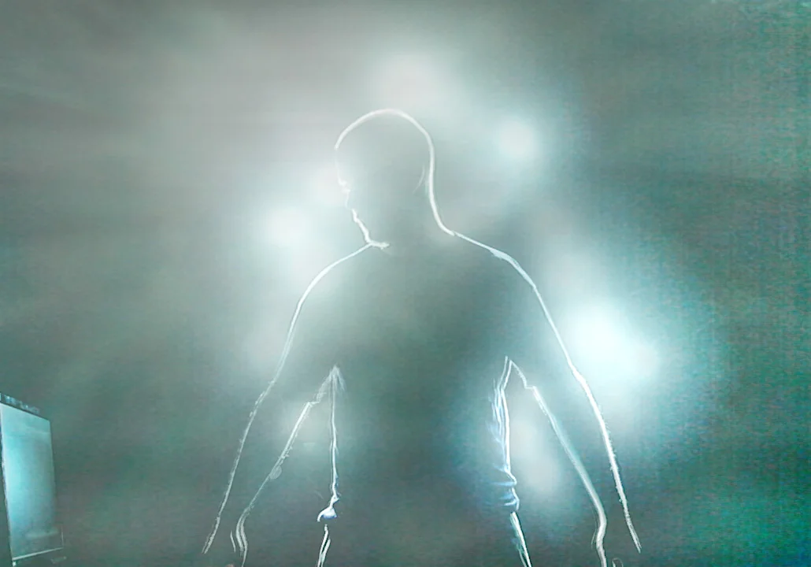

# Camera4d

Browser-based camera app to take ***as much as you like*** long exposure. Stacks camera frames infinitely. View is normalised regardless shooting time.

- Works locally offline in your browser
- Mobile / Laptop / Desktop (OpenGL 2.1 / ES 3.0 or higher, WebGL 2.0)
- Can be used for *multiple exposure* shoots
- Front / Rear camera / resolution etc can be switched during a shoot
- Preview of a current frame as PIP(picture in picture) or ghost(overlay)
- Saves as JPEG or TIFF(high range), or both
- Alpha stage, bugs are expected, **feedback welcome**!

Available as single html: [camera4d.html](src/camera4d.html)

# example photos:

